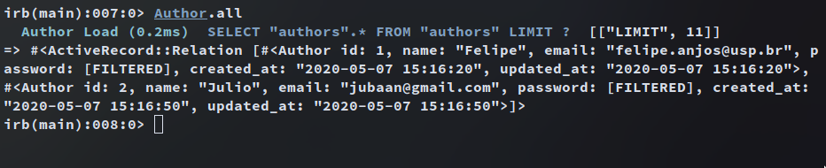

# Building with Active Record

> Collaborative project. We put our knowledge of active record, models, and asossiations to the test.

We created a "micro-reddit" app where users can create a post and add comments to it.

We practice building models and relational databases, doing migrations and making rules for validating the data input.

Models implemented:

- Author: name, email, password, has_many: posts, has_many: comments
- Post: title, body, belongs_to: Author, has_many: Comments
- Comments: body, belongs_to: Author, belongs_to: Post

## Built With

- Ruby on Rails v6.0.2.2

## Authors

👤 **Julio Añoveros**

- Github: [@jubaan](https://github.com/jubaan)
- Twitter: [@AnoverosJulio](https://twitter.com/AnoverosJulio)
- Linkedin: [linkedin](https://www.linkedin.com/in/julio-a%C3%B1overos-b987a8a/)

👤Felipe dos Anjos

- Github: [@githubhandle](https://github.com/fc-anjos)
- Linkedin: [linkedin](https://linkedin.com/in/fc-anjos)

Give a ⭐️ if you like this project!

